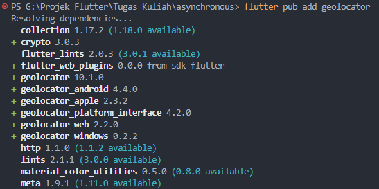
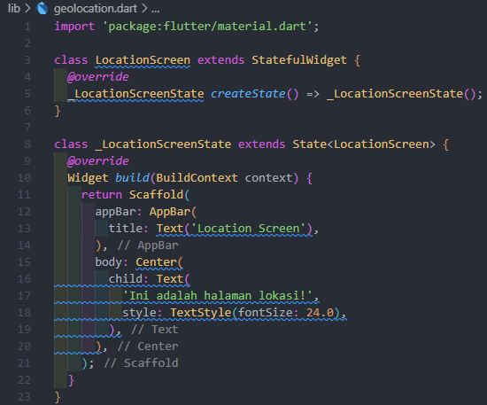

  <h3 align="center">PEMROGRAMAN MOBILE</h3>
  <h3 align="center">Pemrograman Asynchronous</h3>
  

  <h3 align="center">Abiyasa Putra Prasetya</h3>
  <h3 align="center">3G - D4TI</h3>
  <h3 align="center">01</h3>
  <h3 align="center">2141720203</h3>

# Praktikum 1: Mengunduh Data dari Web Service (API)

Langkah 1: Buat Project Baru

Buatlah sebuah project flutter baru dengan nama books di folder src week-12 repository GitHub Anda.

Kemudian Tambahkan dependensi http dengan mengetik perintah berikut di terminal.

Soal 1:

Tambahkan nama panggilan Anda pada title app sebagai identitas hasil pekerjaan Anda.

  

  

Langkah 2: Cek file pubspec.yaml

Jika berhasil install plugin, pastikan plugin http telah ada di file pubspec ini seperti berikut.

  

Langkah 3: Buka file main.dart

Ketiklah kode seperti berikut ini.

  

Langkah 4: Tambah method getData()

Tambahkan method ini ke dalam class _FuturePageState yang berguna untuk mengambil data dari API Google Books.

  

Langkah 5: Tambah kode di ElevatedButton

Tambahkan kode pada onPressed di ElevatedButton seperti berikut.

  

Lakukan run aplikasi Flutter Anda. Anda akan melihat tampilan akhir seperti gambar berikut. Jika masih terdapat error, silakan diperbaiki hingga bisa running.

  

Soal 3:

Jelaskan maksud kode langkah 5 tersebut terkait substring dan catchError!

Jawab:

-  Aplikasi melakukan permintaan untuk mendapatkan data.

-  Jika berhasil, ambil 450 karakter pertama dari data yang diterima dan tampilkan.

-  Jika ada masalah saat ambil data, tampilkan pesan 'An error occured'.

# Praktikum 2: Menggunakan await/async untuk menghindari callbacks

Langkah 1: Buka file main.dart

Tambahkan tiga method berisi kode seperti berikut di dalam class _FuturePageState.

  

Langkah 2: Tambah method count()

Lalu tambahkan lagi method ini di bawah ketiga method sebelumnya.

  

Langkah 3: Panggil count()

Lakukan comment kode sebelumnya, ubah isi kode onPressed() menjadi seperti berikut.

  

Langkah 4: Run

Akhirnya, run atau tekan F5 jika aplikasi belum running. Maka Anda akan melihat seperti gambar berikut, hasil angka 6 akan tampil setelah delay 9 detik.

  

# Praktikum 3: Menggunakan Completer di Future

Langkah 1: Buka main.dart

Pastikan telah impor package async berikut.

  

Langkah 2: Tambahkan variabel dan method

Tambahkan variabel late dan method di class _FuturePageState seperti ini.

  

Langkah 3: Ganti isi kode onPressed()

Tambahkan kode berikut pada fungsi onPressed(). Kode sebelumnya bisa Anda comment.

  

Langkah 4:

Terakhir, run atau tekan F5 untuk melihat hasilnya jika memang belum running. Bisa juga lakukan hot restart jika aplikasi sudah running. Maka hasilnya akan seperti gambar berikut ini. Setelah 5 detik, maka angka 42 akan tampil.

  

Soal 5:

Jelaskan maksud kode langkah 2 tersebut!

Jawab:

Membuat Objek Completer: Kode completer = Completer<int>(); membuat objek Completer yang bertindak sebagai penanda atau penyelesaian (completion) untuk Future yang akan diselesaikan suatu saat nanti.
Objek Completer ini adalah seperti janji untuk memberikan nilai int di masa mendatang yang akan digunakan oleh Future. Saat fungsi calculate() selesai dijalankan, completer.complete(42); akan menandai bahwa nilai yang dijanjikan telah tersedia dan akan menyelesaikan Future yang sebelumnya dibuat.

Jadi, secara sederhana, objek Completer digunakan untuk memberikan nilai ke Future di suatu waktu nanti ketika proses perhitungan selesai dilakukan.

  

# Praktikum 4: Memanggil Future secara paralel

Langkah 1: Buka file main.dart

Tambahkan method ini ke dalam class _FuturePageState

  

Langkah 2: Edit onPressed()

Anda bisa hapus atau comment kode sebelumnya, kemudian panggil method dari langkah 1 tersebut.

  

Langkah 3: Run

Anda akan melihat hasilnya dalam 3 detik berupa angka 6 lebih cepat dibandingkan praktikum sebelumnya menunggu sampai 9 detik.

  

Soal 7:

Capture hasil praktikum Anda berupa GIF dan lampirkan di README

Langkah 4: Ganti variabel futureGroup

Anda dapat menggunakan FutureGroup dengan Future.wait seperti kode berikut.

  

Soal 8:

Jelaskan maksud perbedaan kode langkah 1 dan 4!

Jawab:

-  FutureGroup: Pada langkah 1, FutureGroup digunakan untuk mengelompokkan beberapa Future menjadi satu kelompok sehingga dapat ditangani secara bersamaan. Dalam kasus ini, ketika semua Future yang ditambahkan ke dalam FutureGroup sudah selesai, futureGroup.future akan menghasilkan List<int> dari hasil Future yang terkumpul. Kemudian, hasilnya dijumlahkan dan diperbarui ke dalam setState.

-  Future.wait: Pada langkah 4, Future.wait digunakan untuk menunggu sejumlah Future sekaligus dan mengembalikan List dari hasil Future yang sudah selesai. Ini berguna ketika kamu hanya perlu menunggu sekelompok Future selesai tanpa memerlukan manipulasi lain pada kelompok tersebut. Kemudian, ketika semua Future selesai, Future.wait akan mengembalikan List<int> dengan hasil dari masing-masing Future.

Jadi, perbedaannya terletak pada penggunaan FutureGroup untuk mengelompokkan Future dan kemudian mendapatkan hasilnya sebagai satu List di langkah 1, sedangkan pada langkah 4, Future.wait langsung menunggu sekelompok Future dan mengembalikan hasilnya sebagai List ketika semuanya selesai.

# Praktikum 5: Menangani Respon Error pada Async Code

Langkah 1: Buka file main.dart

Tambahkan method ini ke dalam class _FuturePageState

  

Langkah 2: ElevatedButton

Ganti dengan kode berikut

  

Langkah 3: Run

Lakukan run dan klik tombol GO! maka akan menghasilkan seperti gambar berikut.

  

Pada bagian debug console akan melihat teks Complete seperti berikut.

  

Langkah 4: Tambah method handleError()

Tambahkan kode ini di dalam class _FutureStatePage

  

Soal 10:

Panggil method handleError() tersebut di ElevatedButton, lalu run. Apa hasilnya? Jelaskan perbedaan kode langkah 1 dan 4!

Jawab:

  

-  returnError() dipanggil sebagai Future.

-  Jika returnError() berjalan tanpa masalah, maka kode di dalam then akan dieksekusi. Ini mengatur result menjadi 'Success' dan memperbarui tampilan.

-  Namun, jika returnError() mengalami masalah atau error, maka blok kode di dalam catchError akan dieksekusi. Ini mengatur result menjadi pesan error yang dihasilkan dan memperbarui tampilan.

-  Setelah selesai, kode di dalam .whenComplete() akan dieksekusi, dalam hal ini, akan mencetak 'Complete'. Ini terjadi setelah Future selesai, baik berhasil atau terjadi kesalahan.

# Praktikum 6: Menggunakan Future dengan StatefulWidget

Langkah 1: install plugin geolocator

Tambahkan plugin geolocator dengan mengetik perintah berikut di terminal.

  

Langkah 2: Tambah permission GPS

Jika Anda menargetkan untuk platform Android, maka tambahkan baris kode berikut di file android/app/src/main/androidmanifest.xml

  

Langkah 3: Buat file geolocation.dart

Tambahkan file baru ini di folder lib project Anda.

  

Langkah 4: Buat StatefulWidget

Buat class LocationScreen di dalam file geolocation.dart

  

Langkah 5: Isi kode geolocation.dart

  

Soal 11:

Tambahkan nama panggilan Anda pada tiap properti title sebagai identitas pekerjaan Anda.

Jawab:

  

Langkah 6: Edit main.dart

Panggil screen baru tersebut di file main Anda seperti berikut.

  

Langkah 7: Run

Run project Anda di device atau emulator (bukan browser), maka akan tampil seperti berikut ini.

  

Langkah 8: Tambahkan animasi loading

Tambahkan widget loading seperti kode berikut. Lalu hot restart, perhatikan perubahannya.

  

Soal 12:

Jika Anda tidak melihat animasi loading tampil, kemungkinan itu berjalan sangat cepat. Tambahkan delay pada method getPosition() dengan kode await Future.delayed(const Duration(seconds: 3));

Jawab: 

  

Output:

  

Apakah Anda mendapatkan koordinat GPS ketika run di browser? Mengapa demikian?

Jawab:

  

Saat menjalankan aplikasi Flutter di browser, peramban menyediakan koordinat palsu atau disimulasikan sebagai pengganti nilai GPS yang sebenarnya. Ini memungkinkan aplikasi untuk mengakses "lokasi palsu" yang diberikan oleh peramban untuk keperluan pengembangan dan pengujian, bukan nilai koordinat GPS yang sebenarnya dari perangkat.

# Praktikum 7: Manajemen Future dengan FutureBuilder

Langkah 1: Modifikasi method getPosition()

Buka file geolocation.dart kemudian ganti isi method dengan kode ini.

  

Langkah 2: Tambah variabel

Tambah variabel ini di class _LocationScreenState

  

Langkah 3: Tambah initState()

Tambah method ini dan set variabel position

  

Langkah 4: Edit method build()

Ketik kode berikut dan sesuaikan. Kode lama bisa Anda comment atau hapus.

  

Soal 13:

Apakah ada perbedaan UI dengan praktikum sebelumnya? Mengapa demikian?

Jawab:

Tidak ada perubahan UI

  

Langkah 5: Tambah handling error

Tambahkan kode berikut untuk menangani ketika terjadi error. Kemudian hot restart.

  

Soal 14:

Apakah ada perbedaan UI dengan langkah sebelumnya? Mengapa demikian?

Tidak ada perubahan UI

  

# Praktikum 8: Navigation route dengan Future Function

Langkah 1: Buat file baru navigation_first.dart

Buatlah file baru ini di project lib Anda.

  

Langkah 2: Isi kode navigation_first.dart

  

Soal 15:

Tambahkan nama panggilan Anda pada tiap properti title sebagai identitas pekerjaan Anda.

  

Langkah 3: Tambah method di class _NavigationFirstState

Tambahkan method ini.

  

Langkah 4: Buat file baru navigation_second.dart

Buat file baru ini di project lib Anda. Silakan jika ingin mengelompokkan view menjadi satu folder dan sesuaikan impor yang dibutuhkan.

  

Langkah 5: Buat class NavigationSecond dengan StatefulWidget

  

Langkah 6: Edit main.dart

Lakukan edit properti home.

  

Langkah 8: Run

Lakukan run, jika terjadi error silakan diperbaiki.

  

Soal 16:

Cobalah klik setiap button, apa yang terjadi ? Mengapa demikian ?

Jawab:

Saat menekan tombol 'Change Color' pada layar pertama, aplikasi beralih ke layar kedua yang memiliki tiga tombol: 'Red', 'Green', dan 'Blue' untuk memilih warna.

Namun, ada kesalahan dalam kode yang membuatnya tidak berfungsi sebagaimana mestinya. Variabel yang menyimpan warna pada layar kedua tidak diatur dengan benar, sehingga pemilihan warna tidak berdampak pada layar pertama. Jadi, saat tombol dipilih, perubahan warna tidak tercermin kembali di layar pertama.

Gantilah 3 warna pada langkah 5 dengan warna favorit Anda!

Jawab:

  

Output:

  

# Praktikum 9: Memanfaatkan async/await dengan Widget Dialog

Langkah 1: Buat file baru navigation_dialog.dart

Buat file dart baru di folder lib project Anda.

  

Langkah 2: Isi kode navigation_dialog.dart

  

Langkah 3: Tambah method async

  

Langkah 4: Panggil method di ElevatedButton

  

Langkah 5: Edit main.dart

Ubah properti home

  

Langkah 6: Run

Coba ganti warna background dengan widget dialog tersebut. Jika terjadi error, silakan diperbaiki. Jika berhasil, akan tampil seperti gambar berikut.

  

Soal 17:

Cobalah klik setiap button, apa yang terjadi ? Mengapa demikian ?

Jawab:

Ketika menekan tombol 'Change Color', muncul dialog dengan tiga pilihan warna: 'Red', 'Green', dan 'Blue'. Meskipun memilih warna dari dialog, perubahan warna tidak terjadi di layar utama. Hal ini terjadi karena nilai warna yang dipilih dari dialog tidak diteruskan kembali ke layar utama untuk mengubah warna latar belakangnya.

Gantilah 3 warna pada langkah 3 dengan warna favorit Anda!

Jawab:

  

Output:

  

